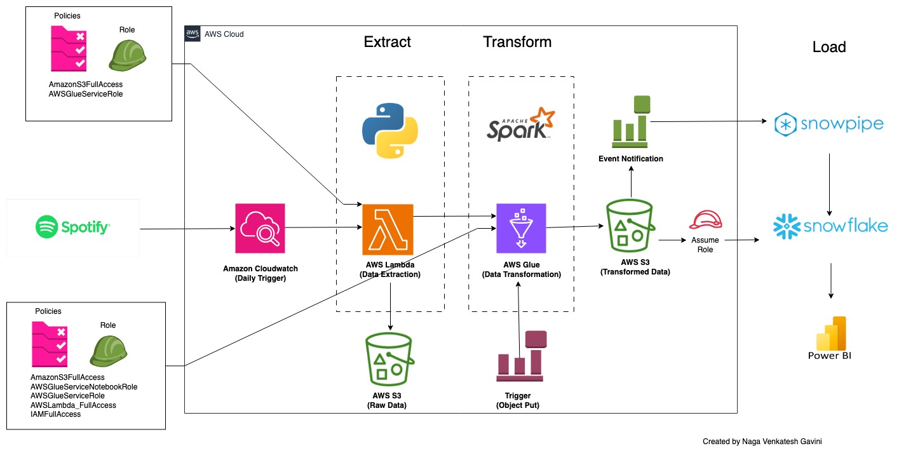

# Spotify ETL Data Pipeline
This project demonstrates a Spotify ETL (Extract, Transform, Load) data pipeline utilizing AWS and Snowflake cloud providers.

**Tech Stack:**
1. AWS I AM
2. AWS Lambda
3. AWS Glue
4. AWS S3
5. Snowflake
6. Apache Spark
7. AWS Triggers and Events

# Architecture:

# Flow of execution: (No manual Intervention Required)
**Step1: (Extract)**
- Lambda function extracts data from "Top most popular songs" using the spotify API.
- Extraction is triggered at regular intervals.
- Raw data is stored in the S3 bucket at `raw_data/unprocessed`.
- AWS Glue job is triggered for the transformation. 
- [Extract Code Link](extract/extract_spotify_lambda.py)

**Step 2: (Transform)**
- A Spark session with 5 workers is created (default configuration).
- Raw data is loaded from the S3 bucket `raw_data/unprocessed`.
- Parallel processing of data:
  - Process Album data and store in S3 at `processed_data/album`.
  - Process Artist data and store in S3 at `processed_data/artist`.
  - Process Songs data and store in S3 at `processed_data/songs`.
- Move processed data to `raw_data/processed` bucket.
- Delete processed data from `raw_data/unprocessed` bucket.
- [Transform Code Link](transform/tranform_on_spark.py)

**Step 3: (Load)**
- Already a snow pipe was created for three buckets(album, artist, songs) to receive notifications.
- When new data arrives in the S3 bucket, the pipe gets triggered and inserts data to respective tables.
- [Load Code Link](load/spotify_load.sql)

## Required I AM roles:

**1. Connecting Snowflake and S3:**
- Create a storage integration stage in Snowflake with an AWS Assume Role ARN.
- Create an Assume Role in AWS with Snowflake’s AWS ARN and External ID.

**2. Triggering with Snow pipe:**
- Create event notifications for S3 buckets.
- Add the pipe’s SQS channel ID during event notification creation.
- This step is required for each bucket: songs, artist, and album.

**3. Other I AM Roles:**
- **Lambda Service Role:**
  - Policies: AmazonS3FullAccess, AWSGlueServiceRole
- **Glue Service Role:**
  - Policies: AmazonS3FullAccess, AWSGlueServiceNotebookRole, AWSGlueServiceRole, AWSLambda_FullAccess, IAMFullAccess
